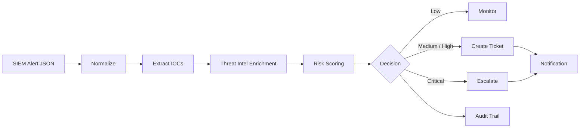

# AegisAutomata SOC Automation Demo

[](https://www.python.org/)
[](https://github.com/isgarlo16-cmd/aegisautomata-soc-automation-demo/actions/workflows/tests.yml)
[](LICENSE)

A safe, vendor-neutral portfolio project demonstrating how a SIEM-style JSON alert can be transformed into an automated SOC response workflow.

**SIEM alert → normalization → IOC extraction → enrichment → risk scoring → decision → ticket + notification + audit trail**

> This repository is a demonstration project, not a customer case study. It uses documentation/example indicators only and does not require production credentials.

## Architecture



## What it demonstrates

- Parsing and normalizing SIEM-style JSON alerts
- Extracting IPv4, domain and SHA-256 indicators
- Local threat-intelligence enrichment
- Deterministic risk scoring with explainable reasons
- Automated SOC decision logic
- Ticket payload creation
- Notification payload creation
- Append-only JSONL audit trail
- Unit tests
- Optional FastAPI wrapper for webhook-style integrations

## Repository structure

```text
.
├── data/
│   ├── sample_alert.json
│   └── threat_intel.json
├── src/aegis_soc/
│   ├── api.py
│   ├── cli.py
│   ├── engine.py
│   ├── models.py
│   └── workflow.py
├── tests/
│   └── test_engine.py
├── DEMO_RESULTS.md
├── pyproject.toml
└── requirements.txt
```

## Quick start

Requirements: **Python 3.10+**

### Linux / macOS

```bash
PYTHONPATH=src python -m aegis_soc.cli \
  --alert data/sample_alert.json \
  --intel data/threat_intel.json \
  --output output
```

### Windows PowerShell

```powershell
$env:PYTHONPATH="src"
python -m aegis_soc.cli --alert data/sample_alert.json --intel data/threat_intel.json --output output
```

The workflow generates:

- `output/decision.json`
- `output/ticket.json`
- `output/notification.json`
- `output/audit.jsonl`

## Run tests

Linux / macOS:

```bash
PYTHONPATH=src python -m unittest discover -s tests -v
```

Windows PowerShell:

```powershell
$env:PYTHONPATH="src"
python -m unittest discover -s tests -v
```

## Optional API mode

Install dependencies:

```bash
pip install -r requirements.txt
```

Start the API:

```bash
PYTHONPATH=src uvicorn aegis_soc.api:app --host 127.0.0.1 --port 8000
```

Submit the included demo alert:

```bash
curl -X POST http://127.0.0.1:8000/process-alert \
  -H 'Content-Type: application/json' \
  --data @data/sample_alert.json
```

Health check:

```bash
curl http://127.0.0.1:8000/health
```

## Example decision

Using `data/sample_alert.json` and `data/threat_intel.json`:

```json
{
  "alert_id": "SENTINEL-2026-00042",
  "score": 100,
  "risk": "critical",
  "action": "escalate"
}
```

See [DEMO_RESULTS.md](DEMO_RESULTS.md) for the complete demonstration summary.

## Security design

- No credentials or API secrets are stored in the repository.
- External actions are represented as payloads instead of being executed against third-party systems.
- Input is treated as untrusted data.
- The workflow is deterministic and testable.
- Example IPs/domains use reserved documentation ranges/names.
- Production implementations should use secret managers and least-privilege service accounts.
- Automation should only be deployed in environments you are authorized to administer.

## Extending the demo

The same pattern can be adapted to real authorized integrations such as:

- Microsoft Sentinel / Defender
- Cortex XSOAR / XSIAM
- CrowdStrike APIs
- Wazuh
- Jira / ServiceNow
- Slack / Microsoft Teams notifications
- Threat-intelligence APIs
- Custom REST APIs and webhooks

The repository intentionally leaves vendor actions mocked so the architecture can be evaluated without credentials or paid services.

## Custom SOC/SIEM automation

AegisAutomata builds custom Python security automations, REST API integrations, enrichment workflows and SOC orchestration for authorized environments.

**Fiverr:** https://www.fiverr.com/s/NeNNYPG

## License

MIT. See [LICENSE](LICENSE).
